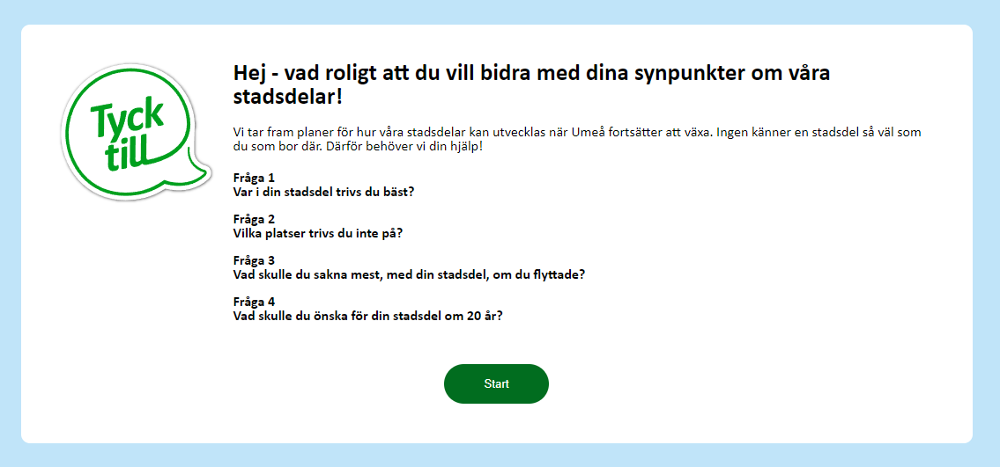

# Stadsdelsdialog

Stadsdelsdialog har en enkät och ett admin gränssnitt som man kan moderera svaren som kommer in. Det finns även en sida där svaren summeras på kommun nivå och på stadsdel.




## Databas
Svaren sparas i en tabell som heter Projektkarta_Enkat.

__Projektkarta_Enkat__
| Kolumnnamn | Typ |
| --- | --- |
| ID | INT |
| Question | nvarchar(500) |
| value | nvarchar(MAX) |
| X | nvarchar(50) |
| Y | nvarchar(50) |
| UserID | nvarchar(50) |
| Show | INT |
| AdminActionDate | nvarchar(50) |
| Stadsdel | nvarchar(100) |
| Anmald | nvarchar(50) |
| Stats_kategori | nvarchar(300) |
| Created | nvarchar(50) |


__Projektkartan_AutoHideWords__
| Kolumnnamn | Typ |
| --- | --- |
| ID | INT |
| Ord | nvarchar(100) |
| Created | nvarchar(50) |

Databasanslutning sätter du i Web projektet [appsettings.json](/src/Stadsdelsdialog.Web/appsettings.json) och Admin projektet [appsettings.json](/src/Stadsdelsdialog.Admin/appsettings.json)
```json
"ConnectionStrings": {
  "DBConnectionString": "Data Source=DB-Server;Initial Catalog=databasename;Persist Security Info=True;User ID=user;Password=123"
}
```

## appsettings.json
Ett mail skickas till mailadresserna (komma separerade) som finns i `Mail_To` om en synpunkt är anmäld.
```json
"AppSettings": {
  "Mail_Server": "",
  "Mail_Port": "25",
  "Mail_From": "",
  "Mail_To": "",
  "RootPath": "https://kartor.umea.se/projektkarta_enkat/"
}
```

## Stadsdelar
GeoJSON fil med alla stadsdelar används föt att kategorisera dem i rätt stadsdel som man kan filtrera på.
Byt ut filen [Stadsdelar.json](/src/Stadsdelsdialog.Web/wwwroot/data/Stadsdelar.json")

> GeoJSON filerna måste vara i SWEREF 99 20 TM (EPSG:3006)

## Bilder

I detta projekt ingår inget medföljande bildmaterial, vilket innebär att ni själva behöver skapa och tillhandahålla eventuella bilder.

>För Admin kolla vilka bilder som måste finnas se [bilder](/src/Stadsdelsdialog.Admin/wwwroot/img/README.md)
>För Web kolla vilka bilder som måste finnas se [bilder](/src/Stadsdelsdialog.Web/wwwroot/img/README.md)
## Bakgrundskartan
För att ändra bakgrundskartan så måste man ändra i [src/Stadsdelsdialog.Web/wwwroot/js/app.ts](/src/Stadsdelsdialog.Web/wwwroot/js/app.ts) i funktionen CreateMap:

```javascript
    CreateMap() {
      ...
      layers.push(map.WMS.getWMS({
        Layer: "Projektkarta_V2",
        Projection: ol.proj.get("EPSG:3006"),
        ZoomRange: 20,
        Resolutions: [3532.8773948498006, 1766.4386974249003, 883.2193487124501, 441.60967435622507, 220.80483717811254, 110.40241858905627, 55.201209294528134, 27.600604647264067, 13.800302323632033, 6.900151161816017, 3.4500755809080084, 1.7250377904540042, 0.8625188952270021, 0.431259447613501, 0.2156297238067505, 0.1078148619033753, 0.0539074309516876, 0.0269537154758438, 0.0134768577379219, 0.006738428868961, 0.0033692144344805]
  }));
```

Byt ut raderna som här till `map.AddLayer` till något som passar för dina kartor.

Här finns ett exempel för ArcGis som är taget från [openlayers.org/en/latest/examples/arcgis-tiled.html](https://openlayers.org/en/latest/examples/arcgis-tiled.html):
```javascript
layers.push(new TileLayer({
    extent: [-13884991, 2870341, -7455066, 6338219], //utbredning av lagret
    source: new TileArcGISRest({
      url: "https://arcgis-server" + "/ArcGIS/rest/services/" + "layername",
      projection: ol.proj.get("EPSG:3006")
    }),
  }));
```
> Lagret måste var i SWEREF 99 TM annars måste du ändra på GeoJson och kanske på fler ställen

### BaseUrl
Webbsidan förutser att den ligger i mappen /projektkarta_enkat/ om man vill ändra det måste man ändra [src/Stadsdelsdialog.Web/wwwroot/js/app.ts](/src/Stadsdelsdialog.Web/wwwroot/js/app.ts)
```javascript
var RootPath = "/";
if (location.hostname !== "localhost") {
    RootPath = "/projektkarta_enkat/";
}
```
>I Stadsdelsdialog.Admin måste man också ändra i [app.js](/src/Stadsdelsdialog.Admin/wwwroot/js/app.ts) och [FysiskEnkat.ts](/src/Stadsdelsdialog.Admin/wwwroot/js/FysiskEnkat.ts)

# Admin
I administrationsdelen finns möjlighet att moderera de inkommande synpunkterna och kategorisera dem baserat på huvudtemat. Dessutom kan man lägga till ord som inte tillåts i synpunkter som visas för allmänheten. Innan synpunkterna visas görs en kontroll i systemet för att flagga eventuella förekomster av dessa ord, så att de inte visas.

Om det har genomförts en fysisk enkät i särskilda områden kan svaren från enkäten matas in i ett separat formulär.

> Admin sidan får inte kommas åt från publika internet det är väldigt engel lösenords hantering
 


## Saker att tänka på 

### koordinatsystem
Om man använder ett koordinatsystem som inte finns med i början av [src/Stadsdelsdialog.Web/wwwroot/js/map.ts](/src/Stadsdelsdialog.Web/wwwroot/js/site.ts) kan man vara tvungen att lägga till den se ex:
 ```javascript
proj4.defs("EPSG:3016", "+proj=tmerc +lat_0=0 +lon_0=20.25 +k=1 +x_0=150000 +y_0=0 +ellps=GRS80 +towgs84=0,0,0,0,0,0,0 +units=m +no_defs");
proj4.defs("EPSG:3006", "+proj=utm +zone=33 +ellps=GRS80 +towgs84=0,0,0,0,0,0,0 +units=m +no_defs ");
proj4.defs("EPSG:4326", "+proj=longlat +datum=WGS84 +no_defs");
proj4.defs("EPSG:3857", "+proj=merc +a=6378137 +b=6378137 +lat_ts=0.0 +lon_0=0.0 +x_0=0.0 +y_0=0 +k=1.0 +units=m +nadgrids=@null +wktext  +no_defs");
```
Och i slutet så läggs utbredning av koordinatsystem se exempel:
 ```javascript
map.AddProjection("SWEREF 99 20 15", new ol.proj.Projection({
    code: "EPSG:3016", //SWEREF 99 20 15
    extent: [-93218.3385, 7034909.8738, 261434.62459999998, 7744215.8],
    units: 'm'
}));
```
> Man kan hämta Extent för ett koordinatsystem på [epsg.io](https://epsg.io/)

### Ändrigar av TypeScript filer (.ts) kan TypeScript CLI behövs 
Du kan installera från npm:
```
npm install typescript
```

### Visual Studio 2022
Vi använder  Visual Studio 2022 och vi använder de här extentions:
* Web Compiler 2022+ (minimering av javascript och kompilering av .less filer)


# License
[MIT](/LICENSE)